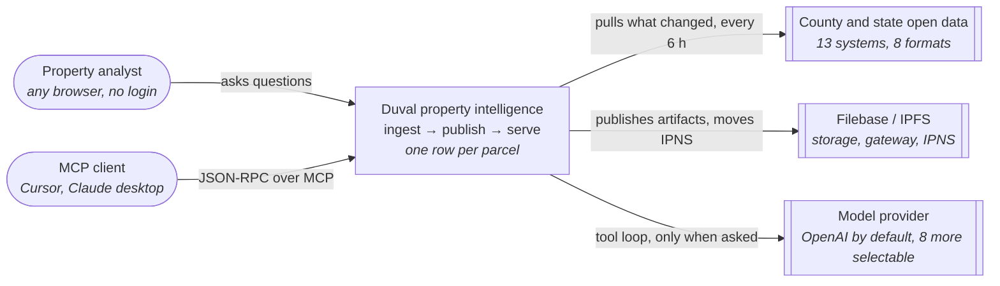
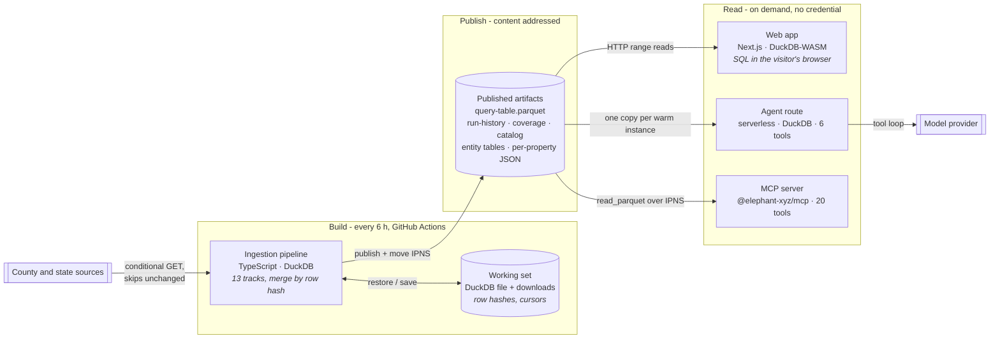
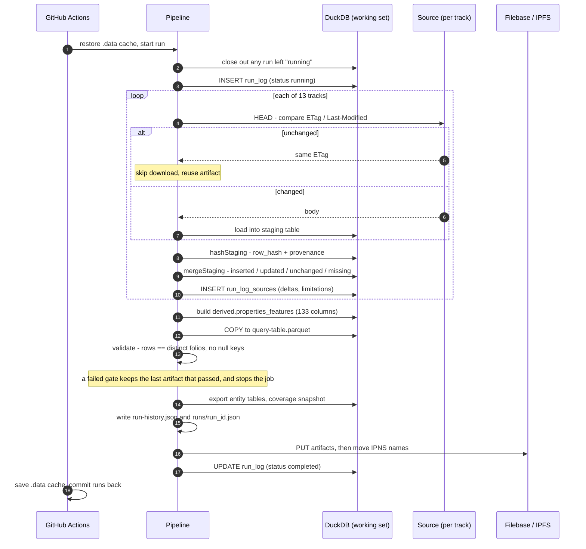
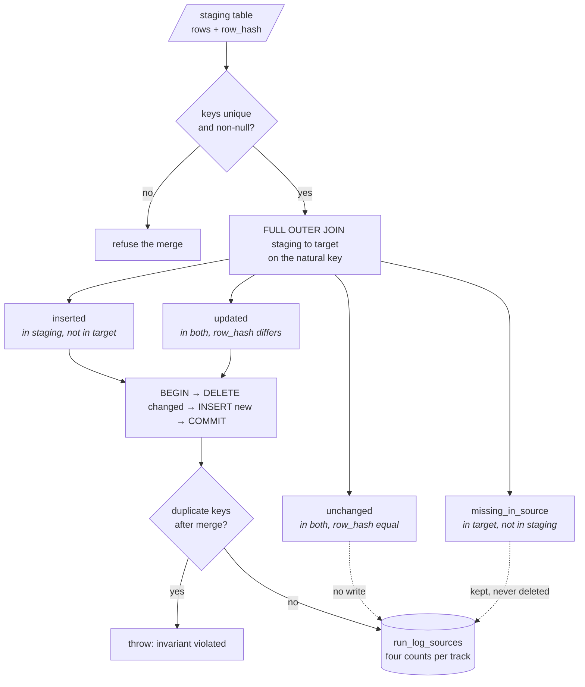
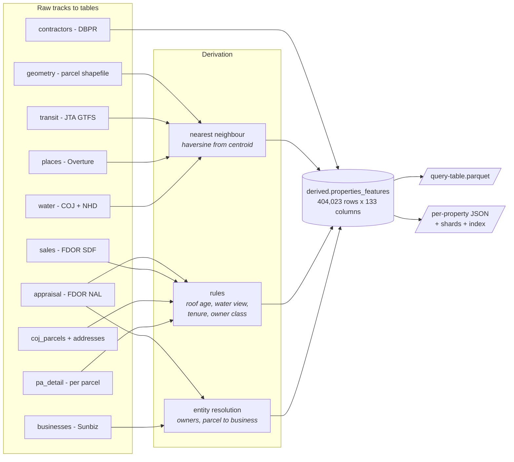
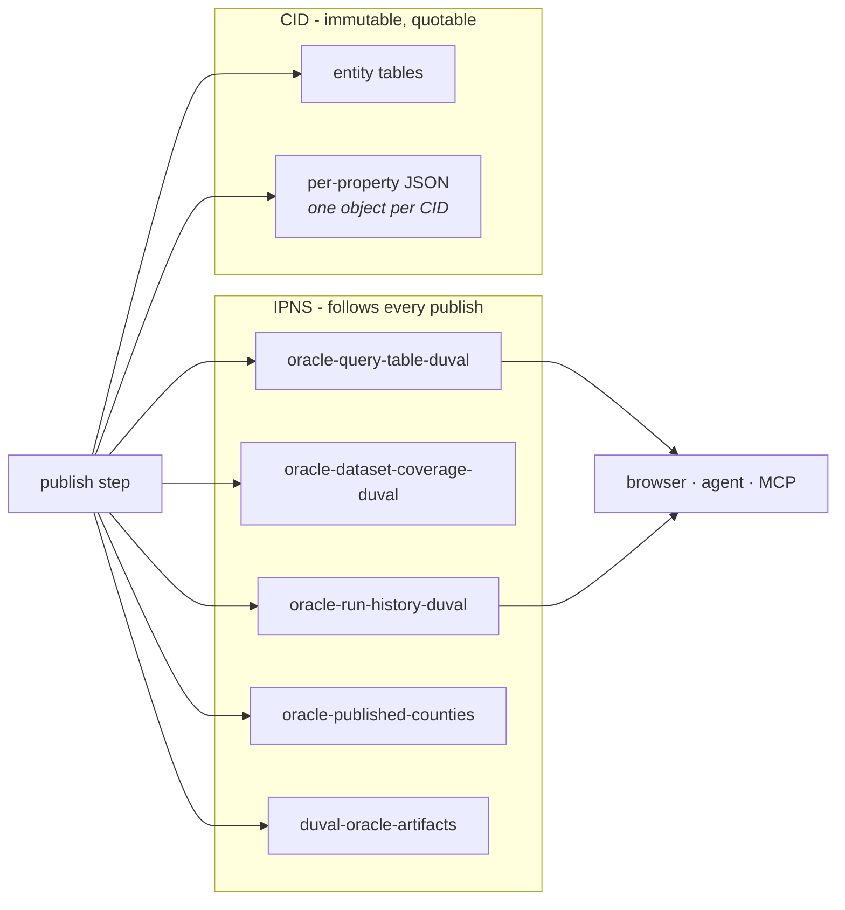
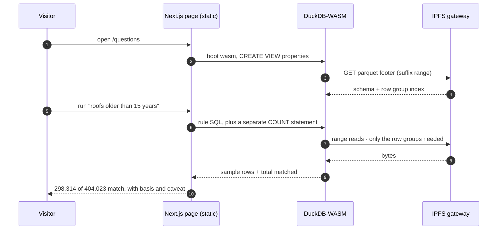
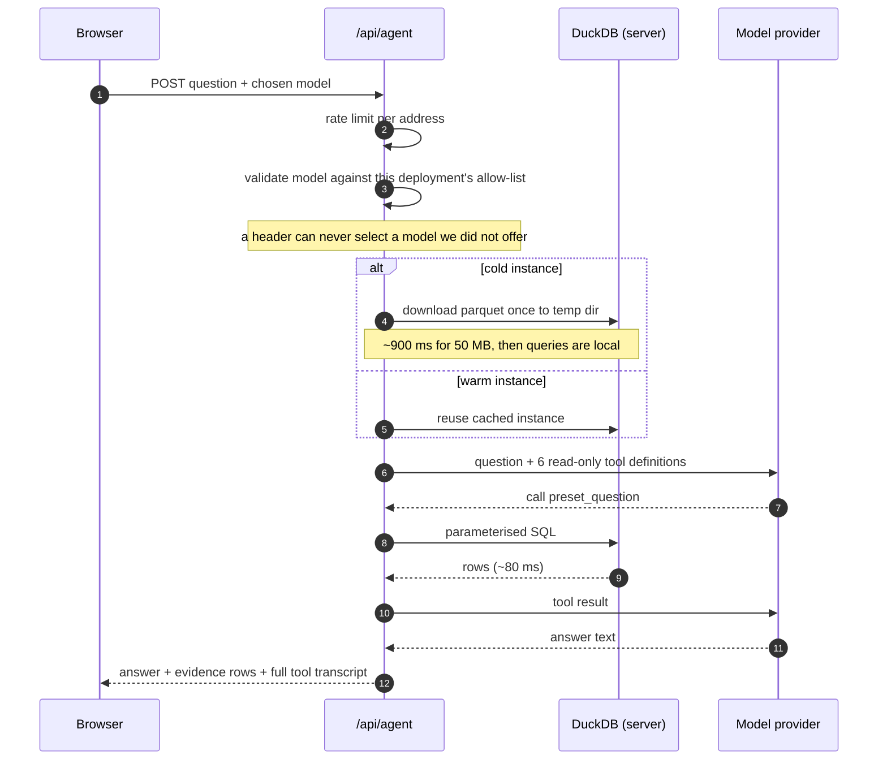
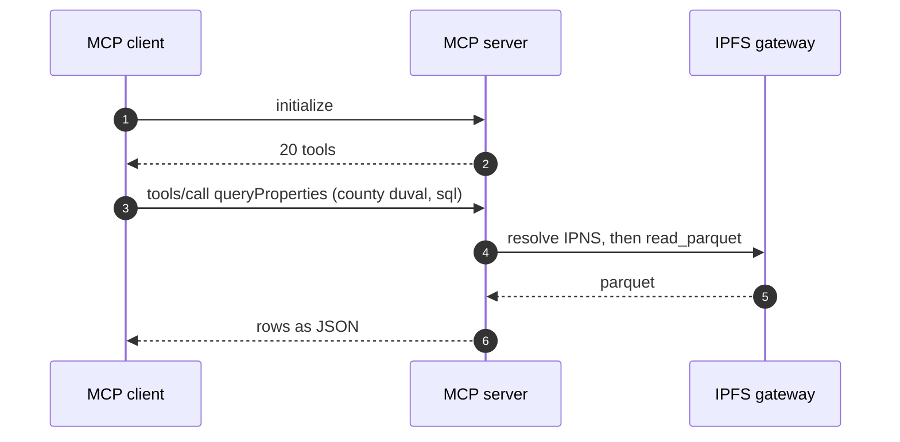

# Architecture

A county-scale property dataset that rebuilds itself every six hours, publishes to IPFS, and is read
straight from there by a browser, an agent, and any MCP client. There is no database to run, no API
tier to keep alive, and nothing consuming money when nobody is looking.

| | |
|---|---|
| Parcels | 404,023, one row each |
| Source systems | 13 tracks: 12 external, 1 derived (FDOR, City of Jacksonville, JTA, NHD, Overture, Sunbiz, DBPR) |
| Refresh | every 6 h on GitHub Actions, incremental |
| Query table | 50,090,904 byte parquet, 133 columns |
| Addressing | 5 IPNS names for what moves, CIDs for what should not |
| Runtime cost when idle | none: no server, no database |

Diagrams follow the **C4 model** (context, then containers). They are drawn as Mermaid flowcharts
rather than Mermaid's experimental `C4Context` blocks, because the flowchart renderer lays out
reliably on GitHub and in any Markdown viewer. Node shape carries the C4 role: rounded is a person,
a plain box is something we build, a cylinder is a data store, and a double-edged box is an external
system outside our control.

---

## 1. Context - C4 Level 1

Who uses it, and what it depends on.



Two kinds of reader. Three outside dependencies, and only one of them - the model provider - costs
anything per use.

---

## 2. Containers - C4 Level 2

The pipeline is the only writer. Everything else reads the published files.



| Container | Built with | Responsibility |
|---|---|---|
| Ingestion pipeline | TypeScript, DuckDB, GitHub Actions | Fetch 13 tracks, merge by row hash, derive the wide table, validate, publish |
| Working set | DuckDB file in the Actions cache | Carries row hashes and per-track cursors between runs - this is what makes a run incremental |
| Published artifacts | Parquet + JSON on IPFS | The product. Immutable by CID, followable by IPNS name |
| Web app | Next.js, DuckDB-WASM | Runs SQL in the visitor's own browser against the published parquet |
| Agent route | Vercel serverless, AI SDK | Plain English in, rows out - the model may only call read-only tools |
| MCP server | `@elephant-xyz/mcp`, unmodified | Same dataset to external tools, pointed at our IPNS names by configuration alone |

---

## 3. One pipeline run, stage by stage

Each run gets a ULID. Every stage writes to `run_log` / `run_log_sources`, which is what later becomes
`run-history.json`.



The validation gate matters, and it guards both passes that build the parquet. The ingestion run
validates and exits non-zero on failure. The consolidation pass, which runs afterwards and rewrites
the same file, builds into `query-table.staging.parquet` and promotes it over `query-table.parquet`
only when the gate passes; a failed gate leaves the last artifact that passed exactly where it was
and exits non-zero, which stops the job before the publish step. A bad build therefore cannot
replace a good published artifact, and it cannot reach IPFS.

---

## 4. The core mechanism - merge by row hash

This is what makes ingestion continuous rather than a nightly reload. Every staged row carries a
`row_hash` over its business columns, plus provenance: `source_system`, `source_url`,
`source_sha256`, `fetched_at`, `run_id`.



Two deliberate choices. Rows that vanish from a source are **counted, not deleted** - a source going
briefly empty must not erase county history. And uniqueness is asserted *after* the merge as well as
before, so a bad join surfaces immediately instead of silently duplicating parcels.

Those four counts per track are the evidence shown on `/runs`. A steady-state run reads
`inserted 0 · updated 0 · unchanged 404,023`.

---

## 5. Data flow - thirteen sources into one row per parcel



Derived columns are computed, never guessed, and each carries a `*_basis` column saying where it came
from, and the UI shows which, so an answer can be trusted without opening the pipeline. The rule for
`roof_age_basis` can emit `PERMIT` (a dated re-roof permit), `EFF_YR_BLT_PROXY` or
`ACT_YR_BLT_PROXY`, but on the published artifact only one of the three actually occurs: measured
over the query table, 359,129 rows carry `EFF_YR_BLT_PROXY` and the remaining 44,894 carry no basis
at all (NULL, and `roof_year_est` and `roof_age_years` are NULL with them). There are zero `PERMIT`
rows because no permit was ever harvested, and zero `ACT_YR_BLT_PROXY` rows. A basis value the data
does not contain is not advertised as if it did.

---

## 6. Addressing - what gets a name, what gets a CID



The rule: **anything a reader follows across runs gets a name; anything quoted as a fact keeps its
CID.** Getting this wrong is not theoretical - the runs page was once pinned to a CID and froze at
eight runs, on the one page whose job is to show that ingestion is continuous.

Gateway lookups cache for 300 s, comfortably inside the 6 h publish cadence.

---

## 7. Read path A - the browser

No server is involved in answering. The page fetches byte ranges of the parquet and runs SQL locally.



The count is a separate statement from the row query, built from the same predicate, so the headline
number can never disagree with the rows beneath it.

---

## 8. Read path B - the agent



The model never reaches the data. It may only *request* a tool; the route runs the SQL. So the rows
returned to the reader are exactly the rows the answer was written from, and the transcript panel
shows every call.

Reading the parquet in place over the gateway was the original design, measured at **158 s of a 172 s
turn**. Copying it once per warm instance took the same tool call to **~80 ms**.

---

## 9. Read path C - MCP

The Elephant ecosystem's own MCP server, deployed unmodified and pointed at our artifacts by
configuration alone.



Configuration is four public URLs, two county keys, and no credential. This is the block the publish
step wrote to `runs/latest-mcp-env.txt` for the artifacts described above, copied verbatim:

```
PROPERTY_QUERY_TABLE_MAP={"duval":"https://ipfs.filebase.io/ipfs/bafybeidex5m2tzcbicfzjn4phgiudr2lpt7lgqf23ajz3gythipqdqhlri"}
PROPERTY_QUERY_TABLE_DEFAULT_COUNTY=duval
DATASET_COVERAGE_MAP={"duval":"https://ipfs.filebase.io/ipfs/bafybeifc2jcwofow6jnjvitl2cekhg57udy6h2jd66lzk2apfako4m2324"}
ORACLE_OPEN_DATA_IPNS_MAP={"duval":"k51qzi5uqu5dig8412edx2zx5x4bxcmilhho2gusgvm7z0wsikrv13nxfzihm2"}
ORACLE_OPEN_DATA_DEFAULT_COUNTY=duval
PUBLISHED_COUNTY_CATALOG_URL=https://ipfs.filebase.io/ipns/k51qzi5uqu5dhbku9cn93fphs8tj703ydh5ypo2tk3k13d5t7tz08pr0qijy7d
```

Those two CID lines move on every publish. Read the current pair from `runs/latest-mcp-env.txt`
rather than from this page.

The addressing is not uniform, and the difference is the point. Anything DuckDB opens gets an
immutable `/ipfs/<cid>` URL, because the gateway returns the CID as the ETag and DuckDB validates it:
a mutable `/ipns/` name re-points on every publish, the ETag changes underneath a warm connection,
and every query then fails until the process recycles. Anything fetched as plain JSON, such as the
catalog, keeps an IPNS name and follows the newest publish on its own. The two query-table lines
therefore have to be re-applied after each publish; `runs/latest-mcp-env.txt` is written by the
publish step so they are copied rather than assembled by hand, and the publish asserts that the
catalog and this block name the same artifact.

Because the view is called `properties` in all three readers, SQL written in the browser workbench
runs unchanged through MCP.

---

## 10. What the data cannot tell you

Recorded against the run that produced it, and shown next to the answer it affects - never buried.

| Limit | Why | Where it shows |
|---|---|---|
| Roof age is often inferred | No re-roof permit exists for most parcels, so year built stands in | `roof_age_basis = EFF_YR_BLT_PROXY` |
| Ownership tenure needs city data | The FDOR roll carries only the current roll year's sales | Fills from COJ sales history, US egress only |
| Walking distance is straight-line | Haversine from the parcel centroid, not a street network | Stated on both proximity questions |
| Contractors have no county field | DBPR publishes none; Duval matched by municipality and 322xx ZIP | Track limitation, overlaps a few neighbouring ZIPs |
| Permits are not open data | JaxEPICS sits behind a WAF; every `/api` probe returns 403 | Recorded per run with the status codes |
| Per-parcel detail is slow by design | ~300 pages per run, 2 concurrent, 400 ms apart | Cursor and throughput in the run record |

---

## 11. Repository map

```
pipeline/               TypeScript ingestion
  src/tracks/           one module per source (13)
  src/features/         derivation, nearest neighbour, rules, export, validation
  src/consolidation/    per-property JSON + shards
  src/publish/          Filebase S3 + IPNS, CID computed locally and verified
ui/                     Next.js app
  app/questions/        the six questions, each with rule, basis and caveat
  app/agent/            chat, model dropdown, evidence panel
  lib/agent/            provider registry, tools, server-side DuckDB
  lib/sql.ts            every statement the UI runs, shared with its tests
.github/workflows/
  pipeline.yml          the 6-hourly run
  publish-artifacts.yml republish the small artifacts without re-ingesting
```

Live system: <https://duval-oracle-ui.vercel.app> · MCP: `https://duval-oracle-mcp.vercel.app/mcp`
